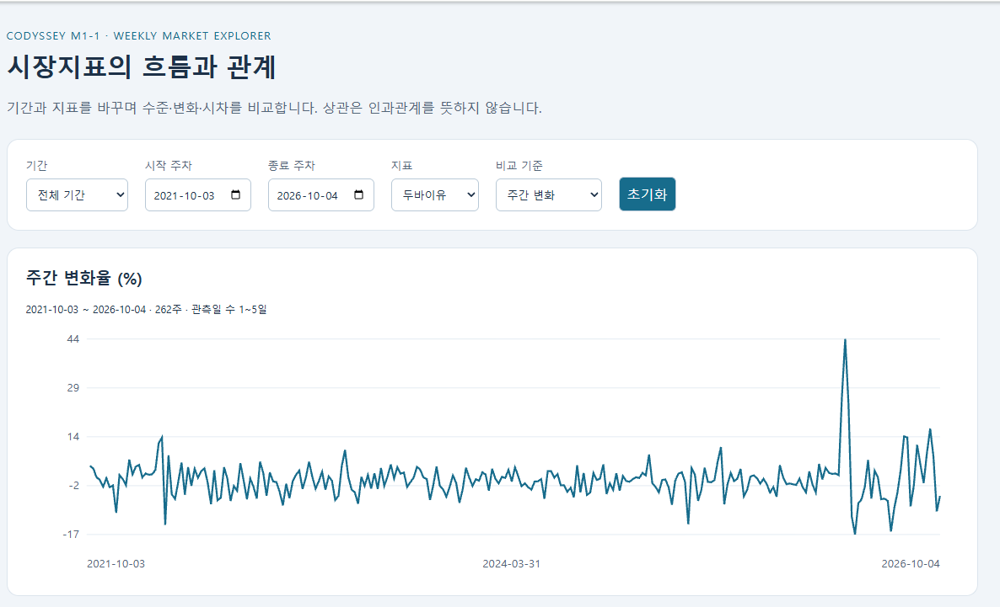
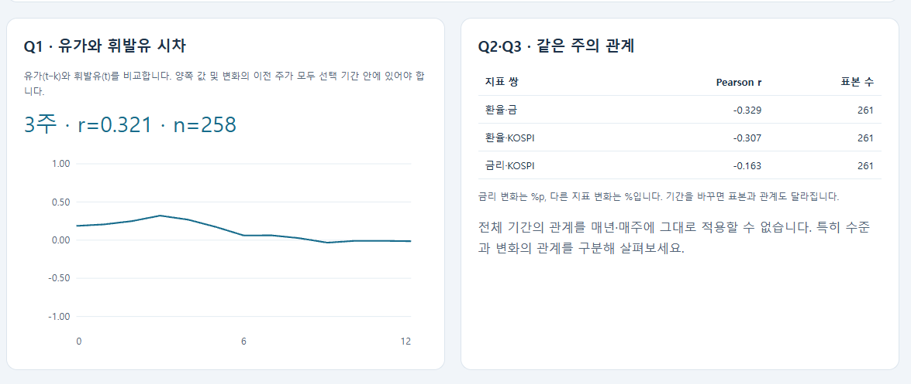
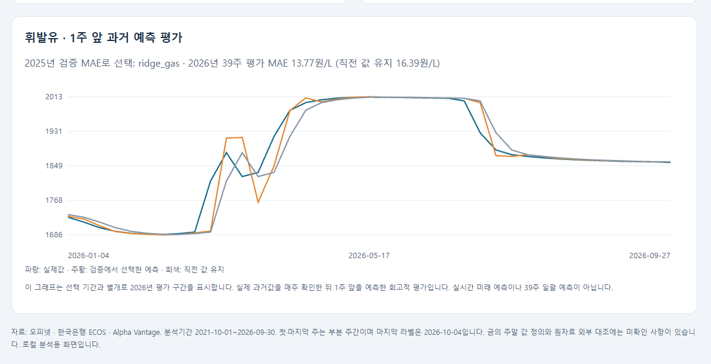

# 대시보드 실행 및 제출 시나리오

구현: 로컬 HTML/JavaScript/SVG 대시보드. 추가 웹 프레임워크·인터넷 CDN을 사용하지 않는다.
제출 방식은 미션의 (3) 스크린샷 세트 + 필터/기간 변경 시나리오를 준비한다.
사용자가 2026-10-05에 제공한 실제 대시보드 화면 캡처 3장을 아래에 수록했다.
세 장은 페이지 상단, Q1~Q3 요약, 예측 패널을 각각 보여준다. 제공된 캡처에 나타난 값과 라벨을 확인했다.
필터를 직접 변경하는 추가 시연 영상은 없다.

## 실행

프로젝트 루트에서 다음 순서로 실행한다.

```bash
python -m pip install -r requirements.txt
python scripts/preprocess.py
python scripts/analyze.py
python scripts/forecast.py
python scripts/build_dashboard.py
python -m http.server 8765 --bind 127.0.0.1 --directory dashboard
```

브라우저에서 `http://127.0.0.1:8765`를 연다. 종료는 서버 터미널의 Ctrl+C.
HTML을 직접 더블클릭하면 JSON 요청이 차단될 수 있으므로 로컬 서버를 사용한다.
서버는 대시보드 폴더만 제공하고 로컬 주소에만 연결한다.

## 스크린샷 시나리오

1. **전체 기간·주간 변화**: 초기 화면, 262주, Q1 최대 3주·r≈0.321.
   환율·금 r≈-0.329, 환율·KOSPI r≈-0.307, 금리·KOSPI r≈-0.163 확인.
2. **2022년·주간 변화**: 기간 메뉴에서 2022년 선택. Q1 최대 1주·r≈0.578,
   환율·금 r≈-0.534, 환율·KOSPI r≈-0.662 확인.
3. **2025년·금리 변화**: 기간 2025년·지표 국고채 3년 선택.
   %p 표시, 금리·KOSPI r≈+0.325 확인. 초기화 버튼으로 전체 화면 복귀.
4. **전체 기간·수준**: 비교 기준을 가격·금리 수준으로 바꾼다.
   환율·금 r≈+0.740, 환율·KOSPI r≈+0.527 확인(원래 정밀도의 반올림 값).
5. **예측 화면**: 아래 예측 패널을 캡처한다. 2026년 39주·선택 모델 `ridge_gas`,
   MAE≈13.77원/L, 직전 값 유지≈16.39원/L 확인. 기간 필터와 별개인 평가 구간임을 설명한다.
6. **빈 기간·짧은 기간**: 시작일>종료일 또는 3주 미만을 선택할 때 오류 안내,
   시차별 20개 미만에서는 표본 부족 안내 확인.

### 제출용 화면 캡처

1. **전체 기간 지표 화면** — 두바이유 주간 변화, 선택 기간과 관측 주 수 표시.
   
2. **Q1~Q3 분석 요약** — Q1 최대 시차 3주(r=0.321, n=258), Q2/Q3 주간 변화 상관 요약.
   
3. **휘발유 1주 앞 과거 예측 평가** — 2026년 39주 MAE 13.77원/L와 직전 값 기준 16.39원/L 비교.
   

위 이미지는 사용자가 제공한 원본 캡처를 이름만 바꾸어 `outputs/evidence/`에 복사한 것이다.
화면의 수치 데이터가 별도로 내려받히지 않도록 대시보드 JSON은 저장소에서 계속 제외한다.
세 제공자의 그래프 공개 허용 확인은 정적 PNG 공개에 대한 것이며, 이 캡처는 그 그래프를 포함한
화면 증빙으로 이해했다. 캡처에서 필터 변경 과정을 녹화하거나 검증한 것은 아니다.

## 해석 기준

필터 선택 기간 안에서 변화를 재계산한다. 첫 주 변화는 제외한다.
Q1은 두 시차 주차가 모두 선택 기간에 있어야 하며 시차별 최소 표본 20개를 요구한다.
Q1~Q3 수치는 선택 기간에 따라 바뀐다. 예측은 비교 조건이 고정된 과거 평가라 필터에 따라 다시 학습하지 않는다.
부분 주간은 전체 화면에 포함되고 관측일 수 범위를 표시한다.
출처·라이선스 한계는 [DATA_SOURCES.md](DATA_SOURCES.md), 분석 결과는 [REPORT.md](REPORT.md)를 참고한다.
