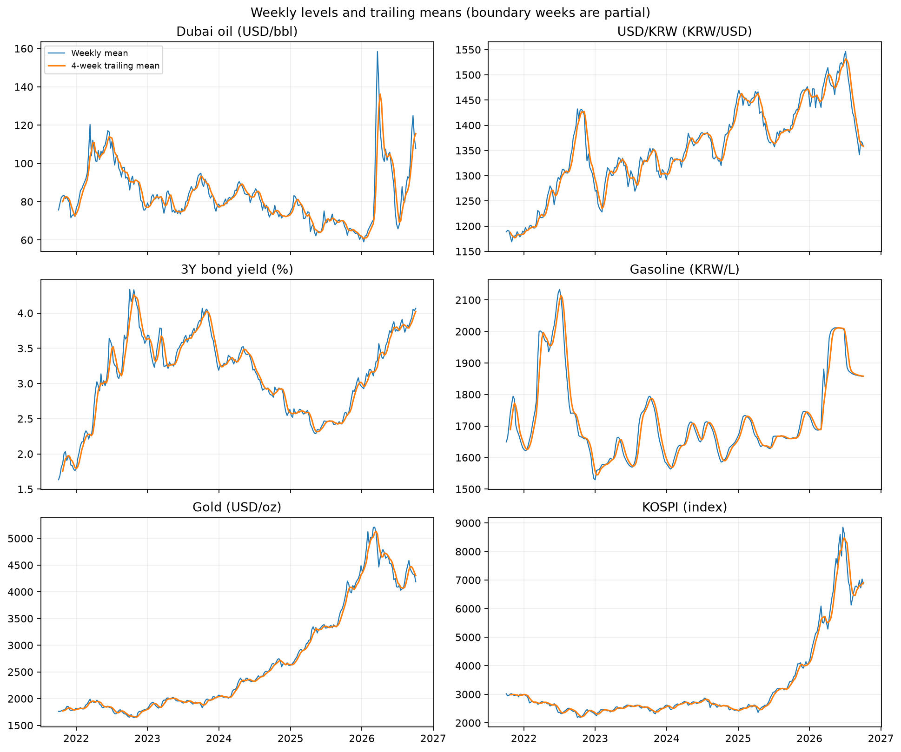
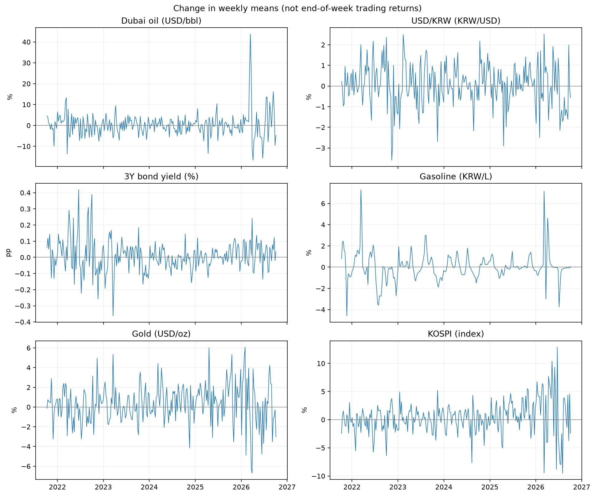
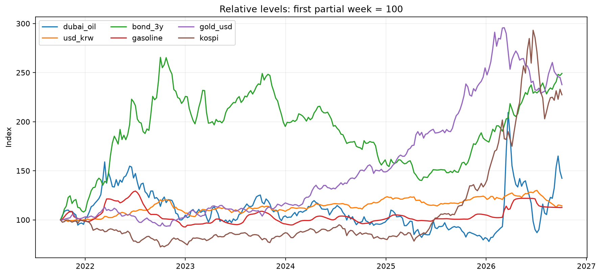
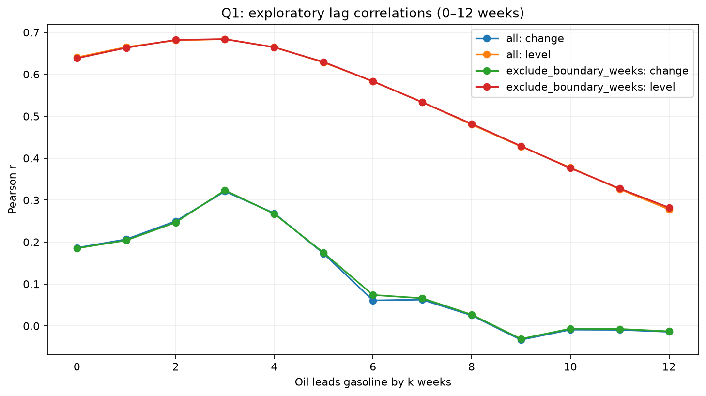
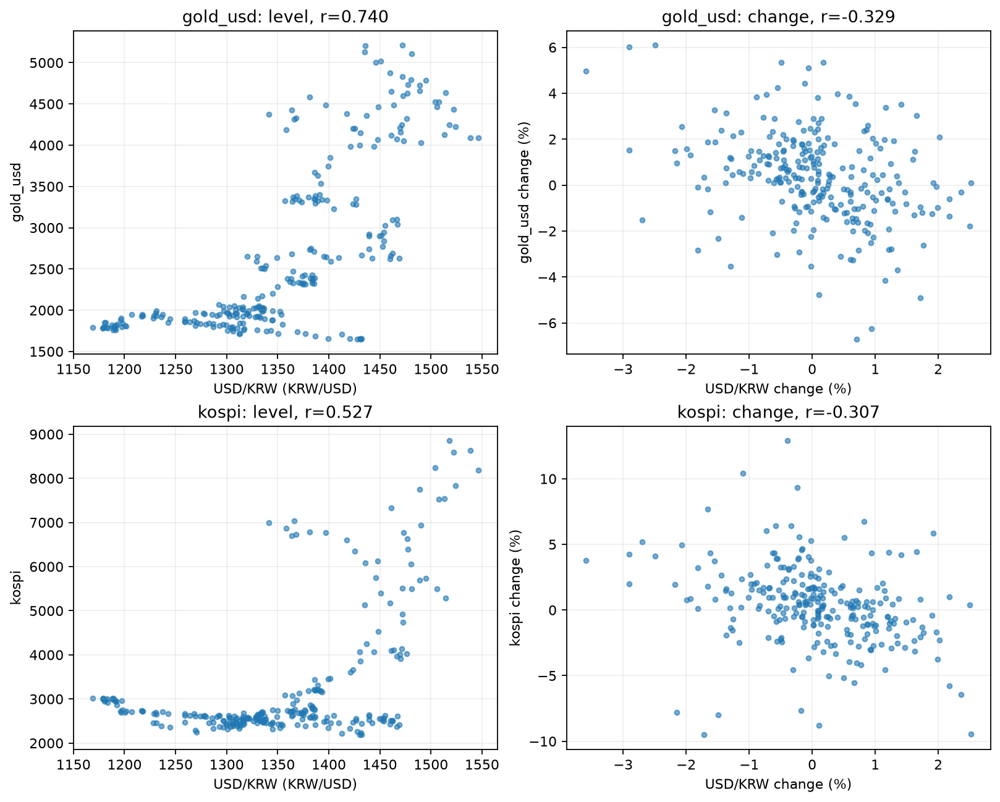
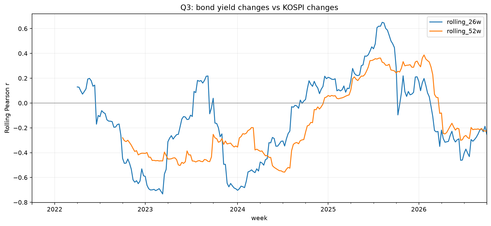
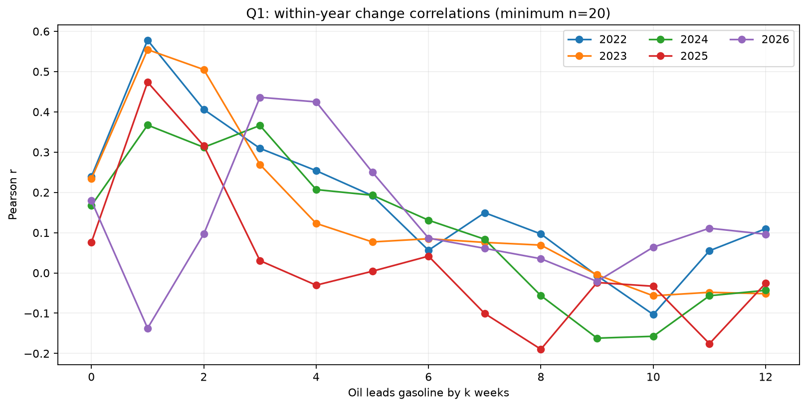
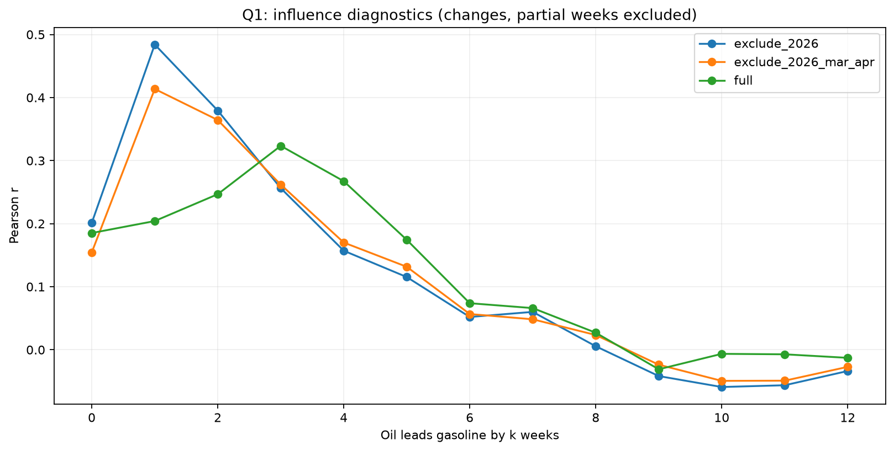
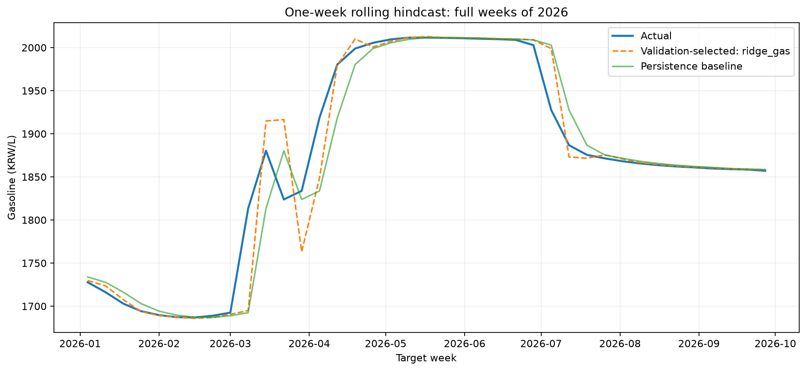

# 시장지표 시계열 관계 분석 리포트

분석 작성일: 2026-10-05. 검증 보완: 2026-10-09. 이 보고서는 공개된 분석 결과와 검증 범위를 설명한다. 미확인 자료 정의는 한계로 표시하며, 원자료 전체의 외부 정확성 검증을 완료했다고 주장하지 않는다.
사용자가 오피넷·ECOS·Alpha Vantage 모두 그래프 공개를 허용했다고 확인하여 정적 그래프 9개를 포함했다.
허용 답변 원문은 전달받지 않았으며, 이 확인을 원자료 재배포 허가로 확대하지 않는다.
출처: 두바이유·전국 보통휘발유는 한국석유공사 오피넷, 환율·국고채 3년·KOSPI는 한국은행 ECOS,
국제 금은 Alpha Vantage. 2021-10-01~2026-09-30의 일별 자료를 주간 평균으로 집계하고
변화율·시차 상관·이동평균·예측 등을 직접 계산한 그림이다. 제공기관의 공식 분석이나 예측이 아니다.
세부 출처와 확인 기록은 [DATA_SOURCES.md](DATA_SOURCES.md), [PUBLICATION_REVIEW.md](PUBLICATION_REVIEW.md)를 참조한다.
예측·로컬 대시보드 구현을 포함한다. 외부 대표값 대조를 일부 수행했으나 두바이유 시리즈 정의 불일치와 금 주말값 정의가 해결되지 않아 원자료 검증은 부분 완료다.

## 먼저 읽는 1분 요약

이 분석은 약 5년 동안 국제유가·환율·금리와 국내 휘발유·금·주식시장이 어떻게 함께 움직였는지 살펴봤다. 하루씩 비교하면 시장마다 쉬는 날이 달라 복잡해질 수 있어, 일주일 평균으로 묶어 비교했다.

1. **국제유가가 바뀐 뒤 휘발유 가격도 움직이는 모습은 보였지만, 늘 같은 시간이 걸리진 않았다.** 전체 자료에선 몇 주 뒤의 변화가 더 잘 맞아 보였지만, 연도별로는 결과가 달랐다. 그래서 “항상 3주 뒤”라고 말할 수 없다.
2. **환율과 금·KOSPI는 긴 기간의 가격 흐름과 매주 오르내리는 모습이 달랐다.** 오랜 기간의 가격 수준은 함께 높아지는 경향이 있었지만, 한 주 단위 변화는 반대 방향인 경우가 많았다. 둘 중 어느 하나가 다른 하나를 움직였다는 뜻은 아니다.
3. **금리와 KOSPI는 늘 반대로 움직이지 않았다.** 2022~2023년에는 반대 방향인 편이었지만, 2024년엔 뚜렷한 관계가 거의 없었고 2025년에는 같은 방향인 편이었다.

여기서 “함께 움직인다”는 것은 두 숫자가 비슷한 시기에 오르거나 내리는 경향을 뜻한다. 원인과 결과를 확인했다는 뜻은 아니다. 아래 세부 결과는 각 경향을 수치와 그래프로 확인한 과정이다.

## 이 보고서 읽는 순서

1. 핵심 결과만 알고 싶다면 이 1분 요약과 [주요 인사이트](#5-인사이트)를 읽는다.
2. 그래프와 숫자를 확인하려면 [분석 결과](#4-분석-방법과-시각화)와 인사이트의 해당 설명을 함께 본다.
3. 세부 검증·민감도 표는 4절의 접기 영역에서 필요한 내용만 펼쳐 본다.
4. 마지막에 [결론 및 한계](#7-결론-및-한계)와 AI 사용 로그를 확인한다.

쉽게 말해, 먼저 “무슨 일이 관찰됐는가”를 읽고, 그다음 “무엇까지 말할 수 있고 무엇은 아직 모르는가”를 확인하는 보고서다.

## 1. 주제 및 선정 이유

국제유가·환율·국고채 3년 금리와 국내 휘발유·국제 금·KOSPI를 비교한다.
쉽게 말해 “해외 시장 숫자가 움직일 때 국내 가격과 주식시장 숫자도 함께 움직이는가?”를 살펴보는 프로젝트다.
시장마다 거래하는 요일이 달라 일주일 평균으로 묶어 비교했다. 따라서 이 보고서의 주간 변화는 하루의 종가 변화가 아니라, 한 주 평균과 그 전 주 평균의 차이다.

## 2. 분석 질문

1. Q1: 국제유가가 오르내린 뒤 국내 휘발유 가격도 움직이는가? 움직인다면 늘 비슷한 시간이 걸리는가?
2. Q2: 환율이 오르내릴 때 금과 KOSPI는 어떤 모습을 보이는가? 긴 기간의 흐름과 한 주씩의 변화도 같은가?
3. Q3: 금리가 오르내릴 때 KOSPI도 반대 방향으로 움직이는가? 이 관계는 해마다 같은가?

초기 질문은 Q1 유가·휘발유의 시차, Q2 환율·금·KOSPI의 관계, Q3 금리·KOSPI의 시기별 관계였다.
1차 탐색에서 전체 기간 3주 시차와 수준·변화 상관의 부호 차이를 관찰해,
사용자와 합의하여 기간별 안정성과 변수 정의를 구체화했다. 초기 질문을 대체해 결과를 숨긴 것이 아니라
후속 질문으로 발전시킨 것이다. 다음 기간별 분석도 같은 자료를 사용한 탐색이며 독립 검증은 아니다.

## 3. 데이터와 처리 기준

- 기간: 2021-10-01~2026-09-30, 주간 262개 관측치, 6개 지표.
- 실제 컬럼: 날짜(`week`), 여섯 지표의 값, 그리고 각 주에 실제 자료가 며칠 있었는지 나타내는 `*_obs_days`.
- 출처·단위·수집 및 재배포 주의: [DATA_SOURCES.md](DATA_SOURCES.md).
- 결측·중복 진단: [전처리 품질 보고서](data/processed/preprocessing_quality_report.md).
- 국제 금: Alpha Vantage API의 일별 종가(Daily Close Price)를 사용했다. 주말 날짜 값의 시장 기준·관측시각은 별도 확인되지 않았다.
- 원자료 보존, 보간 없음. 주간 지표 결측은 모두 0개다.
- 일요일 종료 주차 기준. 처음과 마지막은 부분 주간이며 마지막 라벨 2026-10-04의 실제 입력은 9월 30일까지다.
- 유난히 크게 오르거나 내린 주는 통계 기준으로 후보 표시했다. 후보를 오류라고 단정하거나 삭제하지 않고 그대로 유지했다.
  (세부 기준: 변화량의 사분위 범위에서 1.5배 이상 벗어난 경우)
  원자료 이상 여부는 외부 대표값 대조 결과와 함께 검토했으나 일부 미해결이다([외부 대조 기록](EXTREME_SOURCE_CHECK.md)).

## 4. 분석 방법과 시각화

여기부터는 분석을 어떻게 계산했는지 설명한다. 핵심 결과만 알고 싶다면 앞의 1분 요약과 인사이트 3개를 읽으면 된다.

- **4주 평균:** 최근 4주 숫자를 평균 내어 한 주의 갑작스러운 출렁임을 조금 부드럽게 본다.
- **주간 변화율:** 이번 주 평균이 지난주 평균보다 몇 % 달라졌는지 계산한다. 하루 종가 수익률과는 다른 값이다.
- **금리 변화:** 금리는 퍼센트(%)가 아니라 전주 대비 몇 퍼센트포인트(%p) 바뀌었는지를 비교한다.
- **함께 움직인 점수(상관):** 두 숫자가 비슷한 시기에 같은 방향 또는 반대 방향으로 움직인 정도를 -1에서 +1 사이 숫자로 요약한다. +면 같은 방향, -면 반대 방향, 0에 가까우면 뚜렷한 동행이 적다는 뜻이다. 원인·결과를 알려주는 점수는 아니다. 계산 방식 두 가지(Pearson, Spearman)를 점검했으며, 별도 표시가 없으면 기본 방식(Pearson)의 결과다.
- **13주 출렁임:** 최근 13주 동안 주간 변화가 얼마나 들쑥날쑥했는지를 계산했다. 연간 값으로 환산하지 않았다.

### 전체 수준 및 이동평균



서로 다른 단위를 패널로 분리했다. 전체 주간 변화 표준편차는 유가 5.718%, 환율 1.012%,
휘발유 1.316%, 금 1.959%, KOSPI 2.985%, 금리 0.095%p이다.
금리의 %p와 다른 지표의 %를 같은 척도의 변동성으로 순위화하지 않는다.





정규화는 단위를 맞춰 상대 흐름을 보는 도구다. 첫 주가 부분 주간이라는 점과 기준 시점 의존성이 있다.
금리의 정규화 값은 투자 수익률이 아니다.

### Q1: 유가와 휘발유 시차



시차 k는 `유가(t−k)`와 `휘발유(t)`를 비교한다. 변화율 기준 동시 상관은 0.1862(n=261),
3주 시차는 0.3210(n=258)이다. 수준 기준 3주 시차는 0.6838(n=259)이다.
부분 주간을 제외하고 변화를 다시 계산하면 3주 시차 변화 상관은 0.3234(n=256)이다.
0~12주는 탐색 범위이며, 최고값을 골랐다는 사실을 밝힌다. 다른 시차보다 통계적으로 우수하다고 검정한 것은 아니다.

### Q2: 환율과 금·KOSPI



| 비교 | 수준 상관(n=262) | 변화율 상관(n=261) |
|---|---:|---:|
| 환율·금 | 0.7405 | -0.3287 |
| 환율·KOSPI | 0.5266 | -0.3074 |

전체 수준에서 같이 높아지는 경향과 같은 주에 같이 변화하는 경향은 다르다.
부분 주간 제외 후 변화 상관은 각각 -0.3348, -0.3102로 부호가 유지된다.

### Q3: 금리와 KOSPI의 시기별 관계



금리 차이와 KOSPI 변화율의 전체 상관은 -0.1630(n=261)이다.
연도별로 2022년 -0.4045(n=52), 2023년 -0.3587(n=53), 2024년 0.0483(n=52),
2025년 0.3379(n=52), 2026년 -0.2967(n=40)이다. 연도는 주차 라벨 기준이며
2021·2026년은 전체 연도가 아니다. 26·52주 창은 반년·1년 수준 비교를 위한 탐색 설정이다.

### 트렌드·계절성·노이즈

트렌드는 장기 방향이며 수준·이동평균에서 살펴본다. 계절성은 일정 주기로 반복되는 패턴이고,
노이즈는 추세·주기만으로 설명하기 어려운 단기 변동이다. 실제 사건에 따른 급변도 있으므로 노이즈와 오류를 동일시하지 않는다.
달력의 계절처럼 매년 되풀이되는 패턴이 있는지 월별로 살펴봤지만, 있다고 결론 내리지는 않았다.
약 5년 자료는 반복 횟수가 적고 시장 상황도 해마다 달랐기 때문이다. 월별 결과는 추가로 살펴볼 후보이지 확정된 계절 패턴이 아니다.

### 후속 검토: 기간별 안정성과 관측일 수

<details>
<summary>연도별 숫자와 추가 검증을 펼쳐 보기 (관심 있는 독자용)</summary>

연도별 후속 분석에서는 부분 주간을 제외하고, 각 연도 안에서 변화와 시차를 다시 계산했다.
유가와 휘발유의 두 비교 주차 및 변화 계산에 필요한 이전 주차가 모두 같은 연도에 있도록 했다.
따라서 앞의 연도별 Q3 표(전체 변화 계산 후 연도로 묶음)와 표본 수·수치가 조금 다르다.
2021년은 짧아 Q1 시차 비교에서 제외했다(시차별 유효 표본 최소 20개).
2026년은 9월까지만 포함하므로 다른 연도와 관측기간이 다르다.



| 기간 | 탐색 범위 내 최대 상관 시차 | 변화 상관 | 표본 수 |
|---|---:|---:|---:|
| 2022 | 1주 | 0.5781 | 50 |
| 2023 | 1주 | 0.5546 | 51 |
| 2024 | 1주 | 0.3672 | 50 |
| 2025 | 1주 | 0.4739 | 50 |
| 2026(일부) | 3주 | 0.4361 | 35 |

**Q1의 답변 보완:** 전체 기간의 최대값 3주는 모든 기간의 공통 시차가 아니다.
전체 상관은 연도별 상관의 단순 평균이 아니며, 시기별 변동 크기·표본 구성에 영향을 받는다.
어느 해가 전체 결과를 주도하는지는 추가 분석이 필요하다. 연도별 최고값 역시 탐색 결과이며
최적 시차의 확정 또는 유의한 차이를 증명하지 않는다.

| 기간 | 환율·금 변화 상관 | 환율·KOSPI 변화 상관 | 금리 차이·KOSPI 변화 상관 | 표본 수 |
|---|---:|---:|---:|---:|
| 2022 | -0.5343 | -0.6616 | -0.4045 | 51 |
| 2023 | -0.3663 | -0.5759 | -0.3463 | 52 |
| 2024 | -0.2153 | -0.3322 | 0.0549 | 51 |
| 2025 | -0.2720 | -0.1877 | 0.3245 | 51 |
| 2026(일부) | -0.3787 | -0.1144 | -0.2939 | 38 |

**Q2의 답변 보완:** 위 연도별 변화 관계의 부호는 음수지만 강도는 일정하지 않다.
수준 관계는 연도별 부호도 다르다. 예를 들어 환율·금 수준은 전체 +0.7405와 달리 2022년 -0.8374다.
전체 기간의 수준 관계를 개별 연도나 매주에 그대로 적용할 수 없다.
**Q3의 답변 보완:** 연도 경계 변화를 제외해도 금리·KOSPI 관계의 시기별 부호 차이가 유지된다.

관측일 수 민감도는 비교에 사용한 각 지표의 이번 주·이전 주 모두 최소 3일 또는 4일의 관측치가
있는 경우만 남겼다. 시차 변수는 해당 시차 주차에 동일 조건을 적용했다. 먼저 원래 시간 간격으로
변화·시차를 계산한 뒤 제외하므로, 떨어져 있는 두 주를 이웃한 주처럼 연결하지 않았다.

| 조건 | 유가·휘발유 3주 시차 | 환율·금 | 환율·KOSPI | 금리·KOSPI |
|---|---:|---:|---:|---:|
| 최소 3일 | 0.3234(n=256) | -0.3510(n=249) | -0.3145(n=249) | -0.1554(n=249) |
| 최소 4일 | 0.3290(n=246) | -0.3613(n=229) | -0.3209(n=229) | -0.1504(n=229) |

전체 기간 Q1 최대 시차는 두 조건에서도 3주였다. 주요 부호도 유지됐으나,
3·4일은 탐색용 조건이고 휴장 주차를 선택적으로 제외하는 효과가 있어 원래 표본을 대체하지 않는다.
원자료·전처리 데이터는 수정하지 않았다. 세부 표는 `outputs/analysis/yearly_relationships.csv`,
`q1_yearly_lags.csv`, `q1_yearly_best_lags.csv`, `observation_count_sensitivity.csv`에 있다.

### 급변 구간 영향과 데이터 검토



| 표본(부분 주간 제외) | 최대 Pearson 시차 | 상관 | 표본 수 |
|---|---:|---:|---:|
| 전체 | 3주 | 0.3234 | 256 |
| 2026년 제외 | 1주 | 0.4841 | 219 |
| 2026년 3~4월 제외 | 1주 | 0.4136 | 247 |

제외 비교에서는 원래 주차 간격을 유지하고 각 변화의 현재·이전 주 및 시차 양쪽이 모두
남아 있는 경우만 사용했다. 제외 구간을 건너뛰어 변화율을 계산하지 않았다.
2026년 3~4월은 큰 변동을 관찰한 뒤 선택한 구간이므로 이 비교도 사후 탐색이다.
원래 데이터를 제거·수정하거나 해당 시기를 오류로 판정한 것이 아니다.

유가 주간 변화 표준편차는 2022년 5.037%, 2023년 3.449%, 2024년 2.565%,
2025년 3.899%, 2026년 일부 기간 11.627%였다. 2026년은 기간이 짧지만 변동 크기가 크다.
**큰 변동 구간의 포함 여부가 전체 시차 결과에 영향을 준다**는 해석을 뒷받침한다.
특히 전체 표본의 Spearman 상관은 1주 0.3584, 3주 0.3228로 Pearson의 순위와 다르다.
따라서 3주를 분석 방법과 기간에 무관한 최적 시차로 확정할 수 없다.

각 지표별 절대 변화 상위 3주, 총 18주를 원자료 유래 일별 값으로 재집계했고 저장 주간 평균과 일치했다.
이는 집계 계산의 내부 일치이지 원자료 정확성의 증명은 아니다. 외부 자료로 대표 날짜 일부를 대조한 결과,
금리·휘발유·KOSPI 및 한 환율 급변값은 공개된 수치와 일치하거나 시장 방향과 부합했다.
사용자는 확보 설명서에 적힌 오피넷 Dubai 현물·일간·$/Bbl 기준대로 다운로드했고 원본 CSV도 해당 기준과 부합한다.
오피넷 도움말상 이 값은 싱가포르 거래 Dubai 현물 추정값이며 T일 가격을 T+1일 조사한다.
2026-03-19 로컬 $166.80은 Reuters 보도와 숫자는 같지만, 2026-03-09 로컬 $125.00과
외부 표의 Dubai spot $96.30 차이는 같은 시점·평가방법인지 확인하지 못했다. 이는 다운로드 실수를 뜻하지 않는다.
따라서 대표 외부값만으로 원유 수치의 정확성을 확정하지 않으며, Q1 급변 민감도 해석은 주의가 필요하다.
날짜·단위·출처별 대조와 직접 비교 가능성은 [외부 급변값 대조 기록](EXTREME_SOURCE_CHECK.md)에 정리했다.

금은 일별 종가 자료 1,826일 중 주말 날짜 라벨이 522개(28.6%) 포함된다. 평일만 주간화해도 환율·금 상관은
수준 +0.7402, 변화 -0.3322로 원래 결과(+0.7405, -0.3287)와 비슷했지만,
급변 주간의 크기와 순위는 달라졌다. Alpha Vantage 공식 문서는 일별 역사값을 설명하지만
주말 산출 방식·관측 시간대는 특정하지 않는다. 지원팀에 문의했으나 2026-10-09 현재 답변을 받지 못했다.
따라서 금의 극단 구간 해석은 잠정적이며,
원본 및 기존 주간 결과는 그대로 유지했다([민감도와 검증 기준](DATA_VALIDATION.md)).

</details>

## 5. 인사이트

아래 설명은 숫자를 처음 보는 사람도 이해할 수 있도록 “무엇을 봤는지 → 어떤 모습이었는지 → 어디까지 말할 수 있는지” 순서로 적었다.

### 1) 국제유가와 휘발유: 유가가 바뀌면 주유소 가격도 움직였지만, 시점은 일정하지 않았다

**무엇을 봤나:** 두바이유와 국내 휘발유의 주간 평균이 전주보다 얼마나 바뀌었는지 비교했다. 같은 주에 움직였는지, 유가가 먼저 변한 뒤 몇 주 후에 움직였는지 살펴봤다.

**무슨 모습이었나:** 전체 자료에서는 같은 주보다 3주 뒤의 움직임이 더 비슷했다. 함께 움직이는 정도를 나타내는 점수는 같은 주 `0.19`, 3주 뒤 `0.32`였다. 하지만 2022~2025년은 각각 1주 뒤가 가장 비슷했고, 2026년 일부 기간은 3주 뒤가 가장 비슷했다. 2026년의 큰 출렁임 구간을 빼면 전체 결과도 1주 뒤가 가장 높아졌다.

**쉽게 해석하면:** 국제유가 변화가 국내 휘발유 가격과 바로 동시에 움직이지 않고, 늦게 반영되는 듯한 모습은 있었다. 다만 그 시간이 늘 3주로 고정된 것은 아니었다.

**여기까지만 말할 수 있다:** “유가가 오르면 정확히 3주 뒤 휘발유가 오른다”거나 “유가가 휘발유 가격을 올렸다”고 증명한 분석은 아니다. 환율, 세금, 재고, 정유사 정책 등 다른 요인은 따로 분리하지 않았다.

**말로 설명해 보기:** “유가와 휘발유 가격은 같은 주보다 조금 뒤에 함께 움직이는 경향이 보였습니다. 그런데 해마다 가장 비슷한 시점이 달랐기 때문에, 늘 몇 주 뒤에 반영된다고 단정할 수는 없습니다.”

### 2) 환율과 금·KOSPI: 긴 흐름과 매주 움직임은 서로 달랐다

**무엇을 봤나:** 환율·금·KOSPI의 오랜 기간 가격 수준을 비교하고, 별도로 매주 얼마나 오르거나 내렸는지도 비교했다. 환율이 오른다는 것은 달러 1개를 사는 데 더 많은 원화가 필요해진다는 뜻이다.

**무슨 모습이었나:** 전체 기간의 가격 수준은 환율과 금이 함께 높아지는 경향(점수 `+0.74`), 환율과 KOSPI도 함께 높아지는 경향(`+0.53`)이 있었다. 하지만 주간 변화만 보면 환율과 금은 반대 방향인 편(`-0.33`), 환율과 KOSPI도 반대 방향인 편(`-0.31`)이었다.

**쉽게 해석하면:** 몇 년을 길게 놓고 보는 모습과, 한 주씩 짧게 끊어 보는 모습이 달랐다. 예를 들어 두 사람이 장기적으로 비슷한 방향으로 이동했다고 해서 매주 같은 속도나 같은 방향으로 걷는 것은 아닌 것과 같다. 가격 수준이 함께 높아진 경향이 있다고 해서 매주 함께 오른 것은 아니다.

**여기까지만 말할 수 있다:** “환율이 금이나 주식을 움직였다”는 뜻은 아니다. 금의 주말 날짜 라벨에 적용된 시장 기준과 시각은 확인되지 않았다. 평일만 계산해도 전체 상관은 비슷했지만, 급변 주간의 순위는 달라져 특정 금 급등락을 설명할 때는 주의가 필요하다.

**말로 설명해 보기:** “긴 기간의 가격 수준은 환율과 금·주식이 함께 높아지는 경향이 있었지만, 한 주씩의 변화는 반대 방향인 편이었습니다. 보는 기간을 어떻게 잡느냐에 따라 관계가 다르게 보였고, 이것만으로 환율이 원인이라고 말할 수는 없습니다.”

### 3) 금리와 KOSPI: 늘 반대로 움직인다는 규칙은 보이지 않았다

**무엇을 봤나:** 국고채 3년 금리가 지난주보다 오르거나 내린 폭과, KOSPI가 지난주보다 얼마나 움직였는지를 비교했다. 금리가 3.00%에서 3.10%가 되면 `0.10%포인트` 오른 것이다.

**무슨 모습이었나:** 전체 기간을 합치면 금리와 KOSPI는 약하게 반대 방향이었다(점수 `-0.16`). 해마다 나누면 2022·2023년에는 반대 방향인 편이었지만, 2024년에는 거의 관계가 없었고 2025년에는 같은 방향인 편이었다.

**쉽게 해석하면:** 금리가 오르면 주식이 반드시 떨어진다는 간단한 규칙은 이 자료에서 확인되지 않았다. 주식시장은 금리뿐 아니라 기업 실적, 경기 기대, 환율, 정책, 투자자 심리 등 여러 영향을 함께 받기 때문이다.

**여기까지만 말할 수 있다:** “금리가 KOSPI를 내렸다/올렸다”고 원인을 증명한 것은 아니다. 해마다 보인 차이는 관계가 시기에 따라 달랐다는 관찰이지, 그 이유까지 밝혀낸 결과는 아니다.

**말로 설명해 보기:** “전체적으로는 금리와 주가가 약하게 반대 방향이었지만, 해마다 보면 관계가 달랐습니다. 따라서 금리만 보면 주가 방향을 알 수 있다고 말하기 어렵습니다.”

### 숫자를 읽을 때 기억할 한 가지

보고서의 `+0.74`, `-0.33` 같은 점수는 **함께 오르내린 정도와 방향**을 요약한 것이다. `-0.33`은 33% 하락했다는 뜻이 아니다. 양수면 대체로 같은 방향, 음수면 대체로 반대 방향이라는 뜻이고, 원인과 결과를 증명하지도 않는다.

## 6. 보너스: 휘발유 1주 앞 예측



예측 대상은 다음 완전한 주의 휘발유 평균 판매가격(원/L)이다. 부분 주간을 제외했다.
1주는 단기 baseline 과제와 시점 정렬을 명확하게 하기 위한 설정이며 Q1 최대 시차를 예측 기간으로 복사하지 않았다.
2025-01-05~2025-12-28의 52주를 모델 선택용 검증, 2026-01-04~2026-09-27의 39주를 과거 평가 구간으로 사용했다.
각 주가 끝난 시점에서 다음 주를 예측하고, 새 실제값이 관측되면 학습 기간을 늘려 다시 학습했다.
이는 39주를 한 번에 예측한 결과가 아니다.

후보는 직전 값 유지, 최근 4주 평균, 휘발유 변화만 사용하는 Ridge 회귀,
휘발유·유가·환율 변화를 함께 사용하는 Ridge 회귀다. 회귀는 다음 주 휘발유 변화폭을 예측한 뒤
현재 가격에 더한다. 현재·1주 전 휘발유 변화, 시장 모델에는 현재·1·2주 전 유가 변화와 현재 환율 변화를 사용한다.
정규화 평균·표준편차와 회귀 계수는 매 예측 시점의 과거 학습 자료로만 계산했다.
Ridge의 규제 강도 10은 사전 설정이며 검증·평가 성능을 보며 조정하지 않았다.

| 후보 | 2025 검증 MAE | 2026 평가 MAE | 2026 평가 RMSE |
|---|---:|---:|---:|
| 직전 값 유지 | 6.501 | 16.390 | 32.746 |
| 최근 4주 평균 | 15.105 | 33.808 | 53.825 |
| 휘발유 변화 회귀 | 4.012 | 13.772 | 31.724 |
| 유가·환율 포함 회귀 | 4.877 | 20.364 | 40.657 |

단위는 모두 원/L이다. MAE는 예측이 실제에서 벗어난 절대 거리의 평균이고,
RMSE는 큰 오차에 더 큰 비중을 주는 지표다. 2025 검증 MAE로 휘발유 변화 회귀를 선택했다.
2026 평가 MAE는 직전 값 유지보다 약 16.0% 낮았지만 RMSE 개선은 약 3.1%에 그쳤다.
급변에서 큰 오차가 남아 있음을 보여준다. 유가·환율 입력을 추가했다고 성능이 좋아지지는 않았다.

**한계:** 전체 기간 탐색 분석을 이미 봤으므로 2026년은 완전히 미관찰 상태의 시험이 아니다.
코드상 미래값은 학습·변수에 들어가지 않지만 결과는 교육용 회고적 비교이며 실제 미래 성능을 보장하지 않는다.
주간 평균 공표 지연은 모델링하지 않아 모든 지난주 값이 주말에 이용 가능하다고 가정한다.
급변·세금·정책·재고 등을 반영하지 않았고 구간에 따라 성능이 달라질 수 있다.
실시간 전망치나 투자 의사결정을 제공하지 않는다.

## 7. 결론 및 한계

이 로컬 데이터에서는 수준·변화·시차·기간 구분에 따라 서로 다른 관계가 관찰된다.
부분 주간 제외 후 핵심 부호와 Q1 최대 시차는 유지되지만, 전반적인 강건성을 입증한 것은 아니다.
자기상관·공통 추세·시차 다중 탐색을 고려한 유의성 검정이나 인과 분석은 수행하지 않았다.
시장별 관측일 수와 가격 공표 시각이 다르다. 금 일별 종가의 주말 날짜 라벨에 적용된 시장 기준은 미확인이고 두바이유 일부 일별 값은
비교 기준 차이가 해소되지 않았다. 다른 지표도 대표 날짜만 대조했으므로 전체 원자료 외부 검증은 완료되지 않았다.
따라서 실제 투자·가격 결정의 근거로 일반화하지 않는다. 예측 성능은 위의 과거 평가 범위로 제한한다.

## 8. AI 사용 로그

| 사용 작업 | 사용 이유 | 검증 방법 |
|---|---|---|
| 전처리 코드·설명 작성 지원 | 날짜·구조 통일 및 재현성 확보 | 원자료와 일별 값 비교, 주간 평균·관측일 수 재계산 |
| 요구사항·인수인계 검토 | 누락된 제출 조건 점검 | 미션 원문과 실제 산출물 대조 |
| EDA·시각화·상관 분석 코드 작성 | 여러 분석 기준 비교 | 실제 스크립트 실행, 입력 검증, 별도 수치 계산 및 이미지 확인 |
| 해석·리포트 작성 지원 | 관찰·가설·한계 구분 | 결과 CSV와 수치 대조; 인사이트를 본인이 설명할 수 있는지 학습·발표 연습은 사용자 확인 사항 |
| 급변 구간 영향·출처 검토 | 전체 시차 결과의 민감도 및 오류 가능성 확인 | 지표별 상위 급변 18주 재집계, 대표 외부 수치 표본 대조, 금 주말 평일 민감도; 미해결 불일치 기록 |
| 예측 코드 및 평가 | 단기 baseline과 입력 변수 후보 비교 | 시점·학습 마지막 날짜·실제값 정렬, 별도 MAE/RMSE 계산, 검증 구간 선택 확인 |
| 로컬 대시보드 | 기간·조건별 탐색 지원 | JS 계산/필터/오류 처리 테스트; 사용자가 제공한 실제 화면 캡처 3장을 DASHBOARD_DEMO.md에 수록 |

## 9. 재현 및 추가 확인 안내

```bash
python -m pip install -r requirements.txt
python scripts/preprocess.py
python scripts/analyze.py
python scripts/forecast.py
python scripts/build_dashboard.py
python scripts/verify.py
```

1. 처음 실행하는 방법은 [README 설치·실행 안내](README.md)를 따른다. 전체 분석 순서는 `python scripts/run_pipeline.py` 한 번으로 실행할 수 있다.
2. 검증 환경은 Python 3.14.7이 설치된 같은 Windows 컴퓨터다. 다른 운영체제와 Python 버전에서의 동작은 확인하지 않았다.
3. 전체 실행에서 원자료 7개는 읽기만 하며, 실행 전후 SHA256 비교로 원본 파일이 바뀌지 않았음을 확인했다. 파생 분석표·그림·대시보드 자료는 다시 생성될 수 있다.
4. 자동 검증은 예측 시점과 실제값 정렬, MAE/RMSE 재계산, 주간 평균·관측일 수 재집계, 문서 링크를 확인한다. 대시보드 계산 테스트도 기간·지표 선택과 오류 상황을 점검했다. 이 테스트는 브라우저의 실제 화면 렌더링까지 보증하지 않는다.
5. 두바이유 외부 비교값의 평가 기준이 같은지, Alpha Vantage 금의 주말 값이 어떻게 산출되는지는 확인되지 않았다. 대표값 일부만 대조했으므로 원자료 전체의 외부 정확성 검증이 완료된 것은 아니다. 자세한 내용은 [외부 대조 기록](EXTREME_SOURCE_CHECK.md)과 [데이터 검증 기록](DATA_VALIDATION.md)을 참고한다.
6. 이 자료의 상관·시차 결과는 탐색적 관찰이다. 원인·결과나 미래 시장 방향을 증명하지 않는다.

보고서에서 말하는 “완료”는 정해 둔 분석과 코드 검증을 실행했다는 뜻이며, 출처 자료의 모든 값을 외부 기관과 대조했다는 뜻은 아니다.
